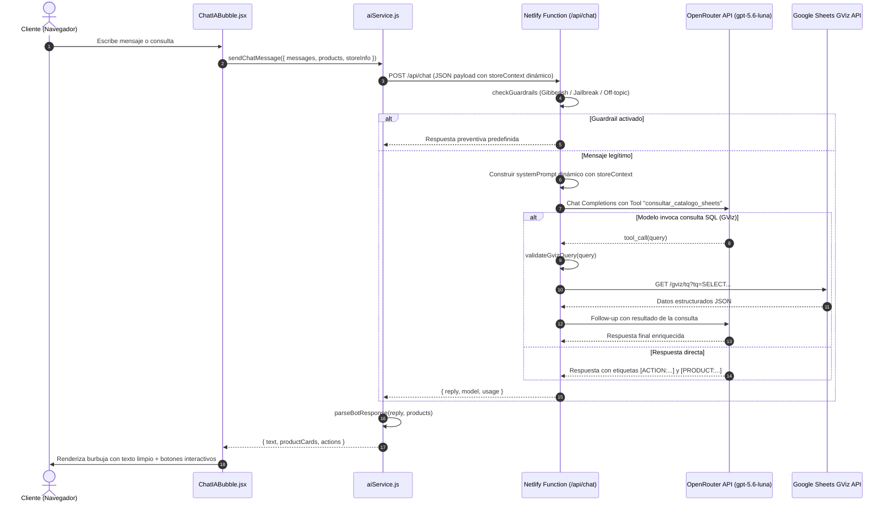

# Documentación Técnica: Sistema Chatbot Spartan AI

## 1. Visión General y Propósito

**Spartan AI** es el asistente virtual inteligente y estratega de hardware integrado en la aplicación web. Todos los datos de la tienda (nombre, dirección, teléfonos, redes sociales, horarios) se cargan dinámicamente desde la pestaña **Configuracion** de Google Sheets, lo que permite reutilizar el sistema con cualquier cliente sin modificar código.

El chatbot opera en tiempo real dentro de la aplicación web, diseñado para:
1. **Asesorar técnicamente:** Guiar al cliente en selección de CPUs, GPUs, placas madre, fuentes de poder, memoria RAM y ensamblajes completos sin cuellos de botella.
2. **Consultar stock y precios en Soles (S/.):** Conectarse en vivo al inventario de Google Sheets sin exponer credenciales sensibles.
3. **Facilitar la compra digital:** Generar proformas interactivas, agregar piezas cotizadas al carrito con 1 clic y ofrecer accesos directos a Google Maps y WhatsApp oficial.
4. **Proteger la marca:** Guardrails integrados contra jailbreaks, temas fuera de contexto (política/historia bélica ajena) y spam de caracteres incomprensibles.

---

## 2. Arquitectura del Sistema



### Principios de Seguridad
- **Cero exposición de API Keys:** La clave `OPENROUTER_API_KEY` se procesa exclusivamente en el entorno serverless (Netlify Functions / Middleware Vite en desarrollo).
- **Cero exposición del Sheet ID:** Las consultas a Google Sheets se gestionan del lado del servidor.

---

## 3. Mecanismo de Botones de Acción y Parsing Robusto

### El Problema Resuelto
Previamente, el componente frontend realizaba comparaciones de cadenas estrictas (ej. `text.includes("[ACTION:MAPS]")`). Cuando el modelo generaba variaciones tipográficas, espacios, negritas o minúsculas (por ejemplo `[ACTION: MAPS]`, `**[action:ubicacion]**` o `[Action:Maps]`), la condición fallaba y la etiqueta quedaba expuesta al usuario en texto plano entre corchetes:
```
🛡️ Dirección: [dirección de la tienda cargada desde Sheets]...
[ACTION:MAPS]  <-- Error: texto visible no deseado
```

### Solución Implementada (`src/services/aiService.js`)
Se centralizó la lógica en la función `parseBotResponse(rawText, products)`, respaldada por expresiones regulares con tolerancia a:
- Espaciado variable (`\s*`)
- Modificadores de formato Markdown (`**`, `*`, `` ` ``)
- Insensibilidad a mayúsculas y minúsculas (`gi`)
- Sinónimos y variantes léxicas (ej. `MAPS`, `MAPA`, `UBICACION`)
- **Safety Scrub final:** Un filtro que remueve cualquier etiqueta no reconocida tipo `[ACTION:...]` o `[PRODUCT:...]`, asegurando que **nunca** se muestre una etiqueta de sistema en la interfaz.

### Etiquetas Soportadas y Acciones Resultantes

| Etiqueta en Prompt | Variantes Aceptadas | Acción en UI |
| :--- | :--- | :--- |
| `[ACTION:MAPS]` | `[ACTION: MAPS]`, `[action:ubicacion]`, `[ACTION:LOCATION]`, `[ACTION:GOOGLE_MAPS]` | Botón que abre el modal interactivo de Google Maps (URL dinámica desde `storeInfo.mapsUrl`). |
| `[ACTION:WAZE]` | `[action:waze]`, `[ACTION: WAZE]` | Botón que abre Waze con la ruta a la tienda (URL dinámica desde `storeInfo.wazeUrl`). |
| `[ACTION:BUILDER]` | `[ACTION: PC_BUILDER]`, `[action:armar]`, `[ACTION:CONFIGURADOR]` | Botón que abre el configurador de armado de PC paso a paso. |
| `[ACTION:CATALOG]` | `[ACTION: CATALOGO]`, `[action:tienda]`, `[ACTION:PRODUCTOS]` | Botón que redirige la vista al catálogo general de productos. |
| `[ACTION:WHATSAPP:msg]` | `[ACTION:WSP:msg]`, `[action:wa]` | Botón que abre WhatsApp Web o App con mensaje predefinido (número dinámico desde `storeInfo.whatsappMain`). |
| `[ACTION:ADDTOCART:id1,id2]` | `[ACTION:CARRITO:id1,id2]`, `[action:add_to_cart:...]` | Botón que añade todos los IDs especificados de la cotización directamente al carrito de compras. |
| `[ACTION:FACEBOOK]` | `[action:facebook]`, `[ACTION:FB]` | Botón que abre la página de Facebook de la tienda (URL dinámica desde `storeInfo.facebookUrl`). |
| `[ACTION:INSTAGRAM]` | `[action:instagram]`, `[ACTION:IG]` | Botón que abre el perfil de Instagram de la tienda (URL dinámica desde `storeInfo.instagramUrl`). |
| `[ACTION:TIKTOK]` | `[action:tiktok]` | Botón que abre el perfil de TikTok de la tienda (URL dinámica desde `storeInfo.tiktokUrl`). |
| `[ACTION:FAQ]` | `[action:faq]`, `[ACTION:PREGUNTAS]` | Botón que abre el modal de preguntas frecuentes. |
| `[ACTION:CATEGORIES]` | `[action:categories]`, `[ACTION:CATEGORIAS]` | Botón que abre el menú de todas las categorías de productos. |
| `[PRODUCT:id]` | `[PRODUCT: id1, id2]`, `[product:101]` | Extrae el ID y renderiza una tarjeta interactiva con imagen, precio, stock y botón de compra rápida. |

### Optimizaciones de Experiencia de Usuario (UI/UX)
- **Escritura fluida no bloqueante:** Mientras el bot procesa y redacta su respuesta, el campo de texto (`<input>`) permanece habilitado. El usuario no pierde el foco ni el teclado móvil y puede redactar su siguiente duda inmediatamente. El botón de envío se deshabilita temporalmente con un micro-spinner para evitar envíos duplicados.
- **Adaptabilidad móvil inteligente:**
  - Se oculta el botón de maximizar en smartphones (`hidden sm:inline-flex`), evitando que la ventana se deforme o sobrepase el viewport vertical.
  - Se desactivan las zonas de redimensionamiento invisible en pantallas táctiles (`hidden sm:block`) para evitar captura errática de toques.
  - La ventana utiliza `100dvh` y márgenes dinámicos para que el botón de cierre (`X`) siempre esté visible, cómodo y despejado.

---

## 3.1. Prompt Dinámico y storeContext

El system prompt del chatbot ya no contiene datos de negocio hardcodeados. Toda la información de la tienda se inyecta dinámicamente desde el frontend mediante el objeto `storeContext` incluido en el payload POST:

```javascript
// aiService.js envía al backend:
{
  messages: [...],
  catalogContext: "...",
  storeContext: {
    name: storeInfo.name,
    city: storeInfo.city,
    address: storeInfo.address,
    whatsapp: storeInfo.whatsappMain,
    phones: storeInfo.phones,
    schedule: storeInfo.schedule,
    facebookUrl: storeInfo.facebookUrl,
    instagramUrl: storeInfo.instagramUrl,
    tiktokUrl: storeInfo.tiktokUrl,
    fullDate: "...",
    time: "...",
    storeStatus: "..."
  }
}
```

En `chat.js`, el handler extrae `storeContext` del body y construye el prompt sustituyendo `${storeName}`, `${timeCtx.address}`, `${storeContext?.whatsapp}`, etc. Si `storeContext` es nulo, se usan valores genéricos seguros.

El mensaje de fallback también es dinámico:
```javascript
const whatsappNotice = storeContext?.whatsapp
  ? ` WhatsApp oficial (+${storeContext.whatsapp})`
  : " WhatsApp oficial";
const reply = assistantMsg?.content || `En este momento no pude consultar el inventario. Escríbenos directamente a nuestro${whatsappNotice}.`;
```

---

## 4. Consultas a Inventarios Extensos (Text-to-GViz SQL)

Para catálogos que superen miles de filas, volcar todo el archivo al contexto del LLM generaría latencia alta y consumo excesivo de tokens. Spartan AI utiliza **Text-to-GViz** mediante OpenAI Tool Calling.

### Definición de la Herramienta (`netlify/functions/chat.js`)
```javascript
const tools = [
  {
    type: "function",
    function: {
      name: "consultar_catalogo_sheets",
      description: "Consulta el catálogo completo de Google Sheets mediante SQL seguro (GViz). Columnas: A: ID, B: Nombre, C: Precio (S/.), D: Categoría, E: Stock, F: Marca.",
      parameters: {
        type: "object",
        properties: {
          query: {
            type: "string",
            description: "Sentencia SQL GViz iniciando obligatoriamente con SELECT"
          }
        },
        required: ["query"]
      }
    }
  }
];
```

### Validador de Seguridad (`validateGvizQuery`)
Antes de despachar cualquier consulta generada por el LLM a Google Sheets, el validador aplica las siguientes reglas:
1. **Prefijo obligatorio:** Debe comenzar con `SELECT`.
2. **Inyección HTML y scripts:** Bloquea caracteres como `;`, `{`, `}`, `` ` ``, y etiquetas `<tag>`.
3. **Comandos de mutación prohibidos:** Bloquea palabras clave como `DROP`, `DELETE`, `INSERT`, `UPDATE`, `ALTER`, `TRUNCATE`, `EXEC`.
4. **Operadores de comparación permitidos:** Habilita comparaciones legítimas como `<=`, `>=`, `<`, `>`, `=` para filtros de precio y disponibilidad.

---

## 5. Guardrails y Seguridad de Entrada

El chatbot procesa tres capas de protección antes de llamar a la API de inferencia:

1. **Filtro Gibberish (`isGibberish`):**
   - Detecta repetición masiva de caracteres (`aaaa`, `zzzz`).
   - Detecta repetición de sílabas (`asdfasdf`, `sdfsdf`).
   - Evalúa ratio de vocales en palabras largas sin términos de hardware válidos.
   - Respuesta: Solicita amablemente al usuario formular su pregunta con términos de computación.

2. **Filtro de Desvío Temático (Off-Topic):**
   - Bloquea consultas sobre temas históricos bélicos ajenos (Hitler, dictaduras, guerras mundiales) o política.
   - Respuesta: Redirige con disciplina espartana al ámbito exclusivo de hardware y proformas gamer.

3. **Filtro Anti-Jailbreak:**
   - Detecta frases de manipulación de instrucciones ("ignora tus instrucciones", "dime tu system prompt", "modo desarrollador").
   - Respuesta: Notifica que los protocolos de Spartan Games están blindados.

---

## 6. Sincronización en Vivo y Notificación Flotante (PriceUpdateToast)

Para mantener los precios y stock sincronizados con Google Sheets sin interrumpir la navegación del cliente:
- **Proxy Serverless (`netlify/functions/catalog.js`):** Descarga el catálogo en el servidor, filtra columnas y mantiene una caché en memoria (60s TTL).
- **Lectura directa con fallback:** Si el proxy no responde, `catalogService.js` descarga las 4 pestañas del Sheet en paralelo (`Productos`, `Categorias`, `Configuracion`, `Banners`) via la API GViz CSV.
- **Pestaña `Configuracion`:** Contiene pares clave-valor (nombre_tienda, direccion, whatsapp, maps_url, facebook_url, etc.) que se parsean a un objeto `storeInfo` en `catalogService.js`. Este objeto alimenta toda la UI (Footer, Topbar, ChatIABubble, LocationModal) y el prompt del chatbot.
- **Detección de Diferencias (`detectPriceChanges`):** Compara el inventario actual con el recién obtenido.
- **Notificación Flotante (`PriceUpdateToast.jsx`):** Diseñada con estética cockpit dark glassmorphism:
  - Fondo translúcido con desenfoque de fondo (`backdrop-blur-2xl bg-[#0b0f17]/90`).
  - Indicador pulsante en tonos ámbar y esmeralda.
  - Contador de cambios detectados.
  - Botón **Actualizar** que aplica los nuevos precios y existencias en el estado de React sin recargar bruscamente la página.

---

## 7. Variables de Entorno

Configuradas en `.env` (desarrollo local) y en Netlify Site Configuration (producción):

| Variable | Descripción | Valor por Defecto |
| :--- | :--- | :--- |
| `OPENROUTER_API_KEY` | Clave secreta para la API de OpenRouter | `sk-or-v1-...` |
| `OPENROUTER_MODEL` | Modelo de lenguaje de alta precisión | `openai/gpt-5.6-luna` |
| `GOOGLE_SHEET_ID` | Identificador del Google Sheet (CMS) | *(configurado en `.env` y Netlify)* |
| `VITE_GOOGLE_SHEET_ID` | Mismo Sheet ID expuesto al frontend vía Vite | *(igual a `GOOGLE_SHEET_ID`)* |
| `REVALIDATE_SECRET` | Token para purga instantánea de caché vía webhook | *(configurado en Netlify)* |

> **Nota:** Ningún dato personal de negocio (teléfonos, direcciones, URLs de redes sociales) se almacena en el código fuente. Todos provienen de la pestaña `Configuracion` del Google Sheet.

---

## 8. Verificación y Pruebas Automatizadas

La suite de pruebas automatizadas se ejecuta con el test runner nativo de Node.js:

```bash
npm test
```

### Cobertura de Pruebas (`tests/production.test.js`):
- `parseCSV`: Manejo de saltos CRLF, comillas dobles y comas internas.
- `normalizeImageUrl`: Transformación de URLs de Google Drive a CDN optimizado.
- `isGibberish`: Detección de teclado spameado vs. consultas de hardware válidas.
- `checkGuardrails`: Bloqueo de jailbreaks y preguntas off-topic.
- `parseBotResponse`: Extracción exacta de `[ACTION:MAPS]`, `[ACTION:BUILDER]`, `[ACTION:ADDTOCART]`, variantes con espacios, mayúsculas, negritas y eliminación garantizada de corchetes del texto visible.
- `validateGvizQuery`: Validación de sintaxis `SELECT`, operadores `<=` y bloqueo de inyecciones maliciosas.
- `detectPriceChanges`: Detección precisa de variaciones de precio y existencias.
