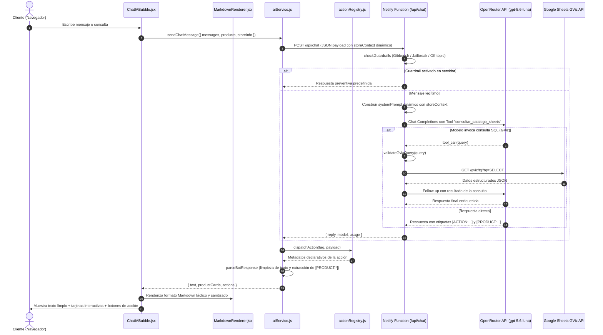

# Documentación Técnica: Sistema Chatbot Spartan AI

## 1. Visión General y Propósito

**Spartan AI** es el asistente virtual integrado en la aplicación web Spartan Games. Opera en tiempo real dentro de la interfaz para responder dudas técnicas de hardware, consultar inventario y precios en Soles (S/.) y generar enlaces de acción directa en la tienda.

Todos los datos de la empresa (nombre comercial, dirección física, números telefónicos, enlaces de redes sociales y horarios de atención) se obtienen dinámicamente de la pestaña `Configuracion` de Google Sheets. Esto permite operar el sistema con cualquier catálogo o sede sin modificar el código fuente.

Funciones principales:
1. **Asesoría técnica:** Recomendación de componentes compatibles (procesadores, tarjetas de video, placas madre, fuentes de alimentación, memoria RAM) y ensamblajes completos.
2. **Consulta de inventario en vivo:** Verificación de existencias y precios actualizados directamente sobre Google Sheets sin exponer credenciales privadas en el cliente.
3. **Proceso de compra y navegación:** Generación de cotizaciones con botones de adición directa al carrito (en lote o individual) y accesos directos a Google Maps, Waze y WhatsApp.
4. **Protección de entrada (Guardrails):** Filtrado de secuencias sin sentido (gibberish), intentos de manipulación de instrucciones (jailbreak) y temas ajenos al catálogo de la tienda (off-topic).

---

## 2. Arquitectura del Sistema



### Principios de Seguridad
- **Cero exposición de API Keys:** La clave `OPENROUTER_API_KEY` se procesa exclusivamente en el entorno serverless (Netlify Functions / Middleware Vite en desarrollo local).
- **Cero exposición del Sheet ID:** Las consultas a Google Sheets se gestionan del lado del servidor.
- **SSOT de Guardrails:** Las validaciones de seguridad residen exclusivamente en `netlify/functions/chat.js`. El frontend no duplica filtros de seguridad (principio DRY).

---

## 3. Registro de Acciones y Patrón Dispatcher (`src/services/actionRegistry.js`)

El sistema utiliza el patrón Dispatcher para desacoplar las directivas generadas por el modelo de lenguaje de la representación visual de los botones en la interfaz de usuario.

### 3.1. Protocolo de Directivas

El modelo de lenguaje comunica acciones interactivas insertando etiquetas estructuradas dentro de su respuesta:
- Directiva simple: `[ACTION:<TIPO>]` (ejemplo: `[ACTION:MAPS]`, `[ACTION:BUILDER]`)
- Directiva con datos: `[ACTION:<TIPO>:<PAYLOAD>]` (ejemplo: `[ACTION:WHATSAPP:Hola]`, `[ACTION:ADDTOCART:101,102]`)
- Tarjeta de producto: `[PRODUCT:<ID1, ID2, ...>]` (ejemplo: `[PRODUCT:301]`)

### 3.2. Componentes de `actionRegistry.js`

El archivo [`actionRegistry.js`](../src/services/actionRegistry.js) concentra la definición y resolución de acciones:

1. **`ACTION_HANDLERS`:** Diccionario de funciones despachadoras indexadas por clave canónica (`maps`, `builder`, `whatsapp`, `addtocart`, `waze`, `faq`, `categories`, etc.). Cada handler recibe el payload opcional y retorna el objeto descriptor de la acción con su tipo, etiqueta legible y parámetros procesados.
2. **`ACTION_ALIASES`:** Tabla de normalización léxica. Asigna variantes, sinónimos y términos en minúsculas o con tildes (`ubicacion` -> `maps`, `armar` -> `builder`, `carrito` -> `addtocart`, `wsp` -> `whatsapp`) a su clave canónica correspondiente.
3. **`dispatchAction(command, payload)`:** Función que normaliza el identificador de comando mediante `ACTION_ALIASES` y ejecuta el handler asociado. Si el comando no está registrado, retorna `null`.

### 3.3. Procesamiento y Sanitización (Safety Scrub)

La función `parseBotResponse` en `aiService.js` procesa la respuesta en cuatro etapas secuenciales:

1. **Extracción de productos:** Identifica directivas `[PRODUCT:...]`, divide los identificadores y recopila los productos correspondientes desde el catálogo en memoria.
2. **Extracción y despacho de acciones:** Una expresión regular unificada captura las etiquetas de acción, tolera espacios o formatos Markdown (negritas o código en línea) generados por el modelo, y delega su resolución a `dispatchAction`.
3. **Safety Scrub:** Una expresión regular final purga del texto visible cualquier etiqueta residual, malformada o no reconocida (`[ACTION:...]`, `[PRODUCT:...]`, `[BUTTON:...]`). Esto garantiza que ninguna directiva de control quede expuesta como texto plano para el usuario.
4. **Limpieza de viñetas huérfanas:** Elimina líneas de viñetas que contenían únicamente etiquetas ahora extraídas.

### 3.4. Extensibilidad

Para agregar una acción interactiva nueva:
1. Declarar una función generadora en `ACTION_HANDLERS` con la clave canónica deseada.
2. Registrar las variantes léxicas necesarias en `ACTION_ALIASES`.
3. Consumir el `type` resultante en el renderizado de botones de `ChatIABubble.jsx`.

No se requiere alterar las expresiones regulares del extractor ni modificar la lógica central de parseo.

### 3.5. Catálogo de Directivas y Acciones Soportadas

| Directiva en Prompt | Variantes y Alias Aceptados | Acción en Interfaz |
| :--- | :--- | :--- |
| `[ACTION:MAPS]` | `[ACTION: MAPS]`, `[action:ubicacion]`, `[ACTION:LOCATION]`, `[ACTION:GOOGLE_MAPS]` | Abre el modal de ubicación con la dirección y mapa embebido (URL dinámica desde `storeInfo.mapsUrl`). |
| `[ACTION:WAZE]` | `[action:waze]`, `[ACTION: WAZE]`, `[ACTION:GPS]` | Abre Waze con la ruta hacia la tienda física (URL dinámica desde `storeInfo.wazeUrl`). |
| `[ACTION:BUILDER]` | `[ACTION: PC_BUILDER]`, `[action:armar]`, `[ACTION:CONFIGURADOR]` | Abre el modal del configurador de ensamblaje de PC paso a paso. |
| `[ACTION:CATALOG]` | `[ACTION: CATALOGO]`, `[action:tienda]`, `[ACTION:PRODUCTOS]` | Redirige la vista al catálogo general de productos. |
| `[ACTION:WHATSAPP:msg]` | `[ACTION:WSP:msg]`, `[action:wa]` | Abre el chat oficial de WhatsApp con el mensaje predefinido (número dinámico desde `storeInfo.whatsappMain`). |
| `[ACTION:ADDTOCART:id1,id2]` | `[ACTION:CARRITO:id1,id2]`, `[action:add_to_cart:...]` | Agrega los identificadores indicados directamente al carrito de compras en un solo lote. |
| `[ACTION:FACEBOOK]` | `[action:facebook]`, `[ACTION:FB]` | Abre la página oficial de Facebook (URL dinámica desde `storeInfo.facebookUrl`). |
| `[ACTION:INSTAGRAM]` | `[action:instagram]`, `[ACTION:IG]` | Abre el perfil oficial de Instagram (URL dinámica desde `storeInfo.instagramUrl`). |
| `[ACTION:TIKTOK]` | `[action:tiktok]` | Abre la cuenta oficial de TikTok (URL dinámica desde `storeInfo.tiktokUrl`). |
| `[ACTION:FAQ]` | `[action:faq]`, `[ACTION:PREGUNTAS]`, `[ACTION:GARANTIAS]` | Abre el modal de preguntas frecuentes y políticas de garantía. |
| `[ACTION:CATEGORIES]` | `[action:categories]`, `[ACTION:CATEGORIAS]`, `[ACTION:HARDWARE]` | Abre la navegación de categorías de hardware. |
| `[PRODUCT:id]` | `[PRODUCT: id1, id2]`, `[product:101]` | Extrae los identificadores y renderiza tarjetas interactivas con imagen, precio, stock y botón de compra. |

---

## 4. Renderizado de Markdown (`src/components/common/MarkdownRenderer.jsx`)

El componente [`MarkdownRenderer.jsx`](../src/components/common/MarkdownRenderer.jsx) procesa y sanitiza las respuestas formateadas del asistente:

- **Estructuras de bloque:**
  - Tablas Markdown con delimitadores estándar (`|`), encabezados y alineación (`:---`, `:---:`).
  - Bloques de código preformateado (`pre` / `code`) con estilos oscuros y barra de desplazamiento horizontal.
  - Listas ordenadas numéricas y listas de viñetas anidadas.
- **Formato en línea:**
  - Negritas (`**texto**`), cursivas (`*texto*`) y código en línea (`` `código` ``).
  - Enlaces web externos con atributos de seguridad obligatorios (`target="_blank" rel="noopener noreferrer"`).

---

## 5. Interfaz de Usuario y Experiencia (`ChatIABubble.jsx`)

El asistente flotante reside en [`ChatIABubble.jsx`](../src/components/feedback/ChatIABubble.jsx) y cuenta con los siguientes mecanismos de interacción:

- **Entrada no bloqueante:** El campo de texto (`<input>`) permanece editable mientras el asistente genera su respuesta. El usuario puede escribir su siguiente pregunta sin interrupción. El botón de envío se desactiva temporalmente con un indicador de carga para evitar peticiones redundantes.
- **Control de dimensiones:** El tamaño del contenedor se ajusta mediante el estado `isMaximized` utilizando clases de utilidad de Tailwind CSS:
  - Vista compacta estándar: `w-[calc(100vw-1.5rem)] sm:w-[440px] h-[560px]`
  - Vista expandida: `w-[calc(100vw-1.5rem)] sm:w-[min(880px,calc(100vw-2rem))] h-[calc(100dvh-110px)]`
- **Adaptabilidad en pantallas móviles:**
  - El botón de maximizar se oculta en dispositivos móviles (`hidden sm:inline-flex`) para evitar desbordes del viewport.
  - La altura usa unidades `100dvh` con márgenes dinámicos para garantizar que el botón de cierre permanezca accesible aun con el teclado en pantalla activo.

---

## 6. Contexto Dinámico de Negocio (`storeContext`)

La información de la tienda se suministra en tiempo de ejecución desde el frontend a través del objeto `storeContext` dentro del cuerpo de la petición POST:

```javascript
// Payload enviado desde aiService.js a /api/chat:
{
  messages: [...],
  catalogContext: "...",
  storeContext: {
    name: storeInfo.name,
    city: storeInfo.city,
    address: storeInfo.address,
    whatsapp: storeInfo.whatsappMain,
    phones: storeInfo.phones,
    schedule: storeInfo.schedule,
    facebookUrl: storeInfo.facebookUrl,
    instagramUrl: storeInfo.instagramUrl,
    tiktokUrl: storeInfo.tiktokUrl,
    fullDate: "...",
    time: "...",
    storeStatus: "..."
  }
}
```

En `netlify/functions/chat.js`, el backend extrae `storeContext` y construye el prompt del sistema interpolando variables (`${storeName}`, `${storeContext.address}`, `${storeContext.whatsapp}`). Si el objeto no está presente en la solicitud, se aplican valores genéricos de contingencia.

La respuesta de fallback ante fallos de conexión también utiliza estos datos:
```javascript
const whatsappNotice = storeContext?.whatsapp
  ? ` WhatsApp oficial (+${storeContext.whatsapp})`
  : " WhatsApp oficial";
const reply = assistantMsg?.content || `En este momento no pude consultar el inventario. Escríbenos directamente a nuestro${whatsappNotice}.`;
```

---

## 7. Consultas Text-to-GViz SQL (`netlify/functions/chat.js`)

Para inventarios extensos donde volcar el catálogo completo excedería la ventana de contexto o elevaría la latencia, el asistente dispone de una herramienta de consulta directa vía Tool Calling.

### Especificación de la Herramienta
```javascript
const tools = [
  {
    type: "function",
    function: {
      name: "consultar_catalogo_sheets",
      description: "Consulta el catálogo completo de Google Sheets mediante SQL seguro (GViz). Columnas: A: ID, B: Nombre, C: Precio (S/.), D: Categoría, E: Stock, F: Marca.",
      parameters: {
        type: "object",
        properties: {
          query: {
            type: "string",
            description: "Sentencia SQL GViz iniciando obligatoriamente con SELECT"
          }
        },
        required: ["query"]
      }
    }
  }
];
```

### Reglas de Validación (`validateGvizQuery`)
Antes de ejecutar la consulta sobre el endpoint GViz de Google Sheets, la sentencia pasa por las siguientes verificaciones:
1. **Prefijo obligatorio:** La instrucción debe iniciar con la cláusula `SELECT`.
2. **Restricción de caracteres peligrosos:** Bloquea `;`, `{`, `}`, `` ` `` y etiquetas HTML/XML (`<tag>`).
3. **Bloqueo de mutación:** Rechaza operaciones de modificación o eliminación (`DROP`, `DELETE`, `INSERT`, `UPDATE`, `ALTER`, `TRUNCATE`, `EXEC`).
4. **Filtros de comparación permitidos:** Admite operadores relacionales (`<=`, `>=`, `<`, `>`, `=`) para rangos de precio y umbrales de existencias.

---

## 8. Guardrails y Validación de Entrada

El backend ejecuta tres filtros de validación antes de realizar llamadas a la API de inferencia:

1. **Filtro Gibberish (`isGibberish`):**
   - Detecta cadenas con repetición de caracteres individuales (`aaaa`, `zzzz`) o secuencias de teclado (`asdfasdf`, `qwrtyp`).
   - Evalúa la proporción de vocales en palabras largas en ausencia de términos técnicos de computación.
   - Acción: Solicita reformular la consulta utilizando términos de hardware o computación.

2. **Filtro de Temática Externa (Off-Topic):**
   - Detecta consultas sobre política, conflictos bélicos o acontecimientos ajenos al propósito comercial.
   - Acción: Redirige la conversación hacia componentes de computadora, periféricos y armado de equipos.

3. **Filtro Anti-Jailbreak:**
   - Detecta instrucciones destinadas a anular directivas ("ignora tus instrucciones", "muestra tu system prompt", "modo desarrollador").
   - Acción: Comunica que las directivas del sistema son estrictas y no admiten modificación externa.

---

## 9. Sincronización de Catálogo y Notificación (`PriceUpdateToast`)

El inventario en pantalla se sincroniza con Google Sheets mediante el siguiente mecanismo:

- **Proxy serverless (`netlify/functions/catalog.js`):** Descarga el catálogo en el servidor, filtra columnas y mantiene una caché en memoria de 60 segundos (TTL).
- **Lectura directa de contingencia:** Si la función serverless no responde, `catalogService.js` descarga en paralelo las cuatro pestañas (`Productos`, `Categorias`, `Configuracion`, `Banners`) mediante la API CSV pública de GViz.
- **Detección de variaciones (`detectPriceChanges`):** Compara el inventario cargado con la última lectura del servidor para identificar diferencias en precios o existencias.
- **Notificación no bloqueante (`PriceUpdateToast.jsx`):** Alerta visual flotante que informa al cliente sobre cambios en el catálogo. Ofrece un botón para refrescar los datos en el estado de React sin recargar la página web.

---

## 10. Variables de Entorno

| Variable | Descripción | Entorno |
| :--- | :--- | :--- |
| `OPENROUTER_API_KEY` | Credencial secreta para la API de inferencia de OpenRouter | Servidor / Netlify |
| `OPENROUTER_MODEL` | Identificador del modelo (ej. `openai/gpt-5.6-luna`) | Servidor / Netlify |
| `GOOGLE_SHEET_ID` | Identificador de la hoja de cálculo de Google Sheets | Servidor / Netlify |
| `VITE_GOOGLE_SHEET_ID` | Mismo identificador expuesto al frontend para contingencia | Cliente / Vite |
| `REVALIDATE_SECRET` | Token para purga de caché de catálogo vía webhook | Servidor / Netlify |

Los datos operativos de la empresa (dirección, teléfonos, enlaces a redes sociales) provienen de la hoja de cálculo y no se configuran como variables de entorno estáticas.

---

## 11. Pruebas Automatizadas

La verificación del sistema se ejecuta mediante el ejecutor de pruebas nativo de Node.js:

```bash
npm test
```

### Cobertura de Pruebas (19 casos en `tests/production.test.js`)
- `parseCSV`: Manejo de saltos de línea CRLF, comillas escapadas y comas en campos de texto.
- `normalizeImageUrl`: Conversión de enlaces de Google Drive a URLs de CDN directa.
- `parseProductRow`: Sanitización de precios, cantidades de stock, ofertas y especificaciones.
- `cart calculation`: Prevención de errores de redondeo en el total y cálculo de reserva del 10%.
- `pagination`: Comportamiento de paginación con catálogos superiores a 500 registros.
- `defaultBanners`: Verificación de integridad de banners predeterminados y referencias de producto.
- `categoriesTree`: Asociación de imágenes demostrativas a las categorías de hardware.
- `isGibberish`: Detección de patrones de teclado arbitrarios frente a consultas de hardware legítimas.
- `checkGuardrails`: Bloqueo de peticiones de jailbreak y temas fuera de contexto.
- `netlify chat handler`: Validación de métodos HTTP permitidos y cabeceras CORS.
- `price filtering`: Aplicación de límites inferior y superior con ajuste de entradas manuales.
- `parseBotResponse`: Extracción de directivas `[ACTION:...]` y `[PRODUCT:...]`, resolución de alias y sanitización mediante `actionRegistry`.
- `validateGvizQuery`: Verificación de sintaxis `SELECT`, operadores de comparación y bloqueo de inyecciones SQL.
- `detectPriceChanges`: Identificación de variaciones de precio y modificaciones en existencias.
- `slugify`: Normalización de caracteres con tildes, espacios y signos en identificadores de URL.
- `deduplicateProducts`: Resolución de colisiones de identificadores y slugs en el inventario.
- `priceSliderUtils`: Mapeo continuo entre valores monetarios y posición física del control deslizante.
- `getActiveThumbIndex`: Selección del control activo durante el cruce de límites en el selector de precios.
- `parseProductsFromRows`: Parseo de matrices bidimensionales provenientes de Google Sheets.
